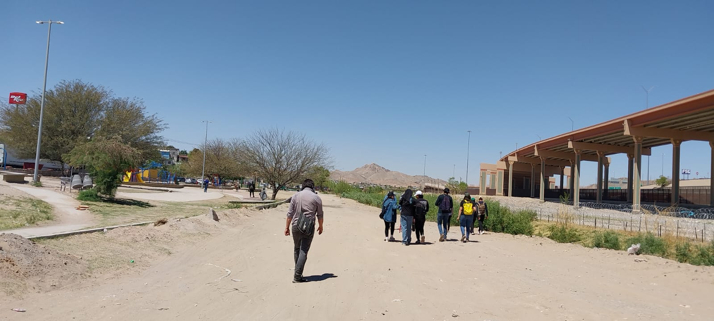

```style.css
:root {
    --main-bg: #ffffff;
    --text-color: #1a1a1a;
    --accent: #7a7a7a;
    --bg-color: #F8F9FA;
    --accent-earth: #A0522D;
    --accent-water: #2F4F4F;
    --accent-green: #556B2F;
    --text-main: #1A1A1A;
}

body {
    margin: 0;
    font-family: 'Inter', sans-serif;
    background: var(--main-bg);
    color: var(--text-color);
    background-color: var(--bg-color);
    color: var(--text-main);
}

.app-bar {
    padding: 20px 40px;
    display: flex;
    border-bottom: 1px solid #eaeaea;
    background: #fff;
    position: sticky;
    top: 0;
    z-index: 100;
}

.logo {
    font-weight: 800;
    letter-spacing: 2px;
    text-decoration: none;
    color: #000;
    font-size: 1.2rem;
}

.nav-links {
    display: flex;
    list-style: none;
    gap: 20px;
    margin-left: auto;
    font-size: 0.75rem;
    text-transform: uppercase;
}

.nav-links a {
    text-decoration: none;
    color: var(--accent);
    transition: 0.3s;
}

.nav-links a:hover {
    color: #000;
}

/* Estilos para el contenedor del dropdown */
.nav-links li {
    position: relative;
    display: inline-block;
}

/* El contenido del dropdown (oculto por defecto) */
.dropdown-content {
    display: none;
    position: absolute;
    background-color: #ffffff;
    min-width: 200px;
    box-shadow: 0px 8px 16px rgba(0, 0, 0, 0.05);
    z-index: 1;
    list-style: none;
    padding: 10px 0;
    margin: 0;
    border: 1px solid #eee;
    text-align: left;
}

/* Enlaces dentro del dropdown */
.dropdown-content li a {
    color: #555;
    padding: 8px 16px;
    text-transform: none; /* Evita que todo sea mayúsculas en submenús */
    display: block;
    font-size: 0.8rem;
}

/* Cambio de color al pasar el mouse por el link del dropdown */
.dropdown-content li a:hover {
    background-color: #f9f9f9;
    color: #000;
}

/* Mostrar el menú al pasar el mouse por el padre */
.dropdown:hover .dropdown-content {
    display: block;
}

.hero-split {
    display: flex;
    flex-direction: column; /* Imagen arriba en móviles */
    align-items: center;
    padding: 60px 10%;
    gap: 40px;
    background-color: var(--bg-color); /* Usando variables de Codigos.md [3] */
}

.hero-visual {
    width: 100%;
}

.hero-img {
    width: 100%;
    height: auto;
    border-radius: 2px;
    /* Mantenemos el enfoque limpio y minimalista */
}

.hero-content-text {
    max-width: 600px;
    text-align: left;
}

/* Estilo para el título con el acento de tierra definido en tus fuentes [2] */
.project-title {
    font-size: 2.5rem;
    line-height: 1.2;
    border-left: 5px solid var(--accent-earth);
    padding-left: 20px;
}

/* Cambio a visualización 'al costado' para escritorio */
@media (min-width: 1024px) {
    .hero-split {
        flex-direction: row; /* Imagen al costado del texto */
        min-height: 80vh;
        justify-content: space-between;
    }
    
    .hero-visual, .hero-content-text {
        flex: 1;
    }
}

.main-footer {
    padding: 60px 10%;
    background: #1a1a1a;
    color: #fff;
    margin-top: 50px;
}

.footer-grid {
    display: grid;
    grid-template-columns: repeat(3, 1fr);
    gap: 40px;
}

.footer-col h4 {
    border-bottom: 1px solid #444;
    padding-bottom: 10px;
    font-size: 0.9rem;
}

.footer-col ul {
    list-style: none;
    padding: 0;
    font-size: 0.8rem;
}

.footer-col ul li {
    margin-bottom: 8px;
}

.footer-col a {
    color: #ccc;
    text-decoration: none;
}

.footer-bottom {
    text-align: center;
    font-size: 0.7rem;
    margin-top: 40px;
    color: #666;
}
```

```index.php
<?php include 'header.php'; ?>

<main>
    <!-- Nueva estructura de Hero Section con imagen integrada -->
    <section class="hero-split">
        <div class="hero-visual">
            <!-- La imagen bg.jpeg ahora es un elemento directo -->
            
        </div>
        
        <div class="hero-content-text">
            <h1 class="project-title">Laboratorio Territorial para la Innovación</h1>
            <p class="tagline">
                "Aprender desde el desierto para transformar el territorio: una red académica
                que forma agentes de cambio en paisajes desérticos de América Latina"
            </p>
            
            <div class="intro-text">
                <p>El Laboratorio Territorial es una plataforma de innovación pedagógica que 
                articula universidades del <strong>Perú, Chile y México</strong> en torno al 
                estudio de los paisajes desérticos. A través del aprendizaje situado y la 
                experiencia directa en el territorio, promueve la comprensión crítica de sus 
                dinámicas y problemáticas.
                <br>
                Este espacio busca integrar academia, comunidad y paisaje para formar agentes
                de cambio comprometidos con el desarrollo sostenible. Asimismo, impulsa la 
                construcción de redes académicas y la generación de conocimiento aplicado desde
                el territorio.</p>
            </div>

            <div class="cta-container">
                <a href="#casos" class="btn-primary">Explorar Casos de Estudio</a>
                <a href="#proyectos" class="btn-secondary">Portafolio de Estudiantes</a>
            </div>
        </div>
    </section>

    <!-- Sección de Proceso Continuo (Fuente 2) -->
    <section id="proyectos" class="info-section">
        <h2>Progresión Académica</h2>
        <p>Plataforma para el seguimiento del avance del estudiante, desde gráficos básicos hasta la complejidad de modelos 3D.</p>
    </section>

    <!-- Sección de bienvenida -->
    <section class="intro-grid">
        <div class="content-text">
            <h2 class="section-title">Laboratorio Territorial</h2>
            <p>Investigación aplicada al hábitat rural y natural.</p>
        </div>
        
        <!-- Gráfico del ecosistema conectado -->
        <div class="diagram-container">
            
            <p class="caption">Ecosistema conectado de investigación.</p>
        </div>
    </section>
</main>

<?php include 'footer.php'; ?>
```

```header.php
<!DOCTYPE html>
<html lang="es">
<head>
    <meta charset="UTF-8">
    <meta name="viewport" content="width=device-width, initial-scale=1.0">
    <title>LAB - Laboratorio Territorial</title>
    <link rel="stylesheet" href="style.css">
</head>
<body>
    <header class="app-bar">
        <nav class="nav-container">
            <a href="index.php" class="logo">LAB</a>
            
            <ul class="nav-links">
                <!-- Sobre el Proyecto -->
                <li class="dropdown">
                    <a href="#sobre">Sobre el proyecto</a>
                    <ul class="dropdown-content">
                        <li><a href="#">Contexto y origen</a></li>
                        <li><a href="#">Problema abordado</a></li>
                        <li><a href="#">Objetivos</a></li>
                        <li><a href="#">Alcance geográfico</a></li>
                        <li><a href="#">Enfoque conceptual</a></li>
                    </ul>
                </li>

                <!-- Marco Metodológico -->
                <li class="dropdown">
                    <a href="#metodologia">Marco metodológico</a>
                    <ul class="dropdown-content">
                        <li><a href="#">Explicación de metodología</a></li>
                        <li><a href="#">Fases (Obs/Análisis/Síntesis)</a></li>
                        <li><a href="#">Enfoques teóricos</a></li>
                        <li><a href="#">Instrumentos</a></li>
                    </ul>
                </li>

                <!-- Casos de Estudio -->
                <li class="dropdown">
                    <a href="#casos">Casos de estudio</a>
                    <ul class="dropdown-content">
                        <li><a href="#">Perú</a></li>
                        <li><a href="#">Chile</a></li>
                        <li><a href="#">México</a></li>
                    </ul>
                </li>

                <!-- Proyectos de Estudiantes -->
                <li class="dropdown">
                    <a href="#proyectos">Proyectos</a>
                    <ul class="dropdown-content">
                        <li><a href="#">Propuestas arquitectónicas</a></li>
                        <li><a href="#">Registro visual</a></li>
                        <li><a href="#">Conceptos de diseño</a></li>
                        <li><a href="#">Relación con el paisaje</a></li>
                    </ul>
                </li>

                <!-- Experiencia Pedagógica -->
                <li class="dropdown">
                    <a href="#pedagogia">Experiencia</a>
                    <ul class="dropdown-content">
                        <li><a href="#">Aplicación en aula</a></li>
                        <li><a href="#">Rol del estudiante</a></li>
                        <li><a href="#">Aprendizajes</a></li>
                        <li><a href="#">Reflexiones y Testimonios</a></li>
                    </ul>
                </li>

                <!-- Más (Resultados, Publicaciones, Recursos) -->
                <li class="dropdown">
                    <a href="#">Más...</a>
                    <ul class="dropdown-content">
                        <li><a href="#">Resultados e Impacto</a></li>
                        <li><a href="#">Publicaciones</a></li>
                        <li><a href="#">Repositorio de Recursos</a></li>
                        <li><a href="#">Equipo</a></li>
                        <li><a href="#">Contacto</a></li>
                    </ul>
                </li>
            </ul>
        </nav>
    </header>
```

```footer.php
    <footer class="main-footer">
        <div class="footer-grid">
            <!-- Columna 1: Identidad -->
            <div class="footer-col">
                <h3>Laboratorio Territorial</h3>
                <p>Investigación sobre entornos experimentales de aprendizaje en paisajes del desierto.</p>
            </div>

            <!-- Columna 2: Ecosistema Conectado (Fuente 3 y 4) -->
            <div class="footer-col">
                <h4>Gestión Interna</h4>
                <ul>
                    <li><a href="#">Intranet de Carrera</a></li>
                    <li><a href="#">Documentación y Reglamentos</a></li>
                    <li><a href="#">Portafolio Académico Docente</a></li>
                </ul>
            </div>

            <!-- Columna 3: Red Institucional (Fuente 1) -->
            <div class="footer-col">
                <h4>Red Académica</h4>
                <div class="logos-grid">
                    <span>UNJBG (Perú)</span>
                    <span>UNAP (Chile)</span>
                    <span>Tec de Monterrey (México)</span>
                </div>
            </div>
        </div>
        <div class="footer-bottom">
            <p>&copy; <?php echo date("Y"); ?> LAB - Proceso continuo de formación arquitectónica.</p>
        </div>
    </footer>
</body>
</html>
```